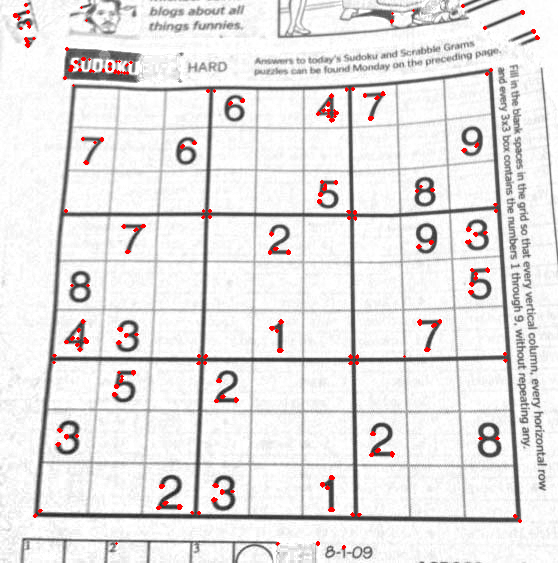
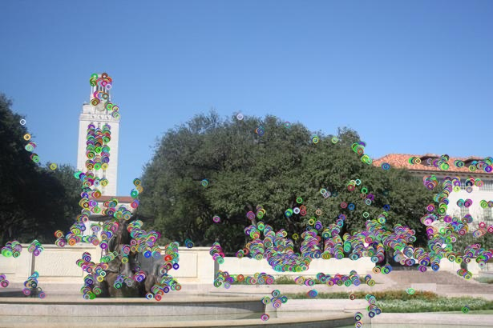
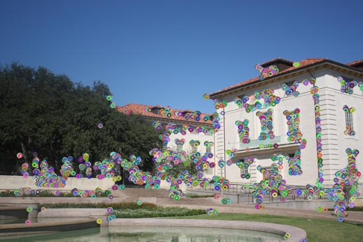
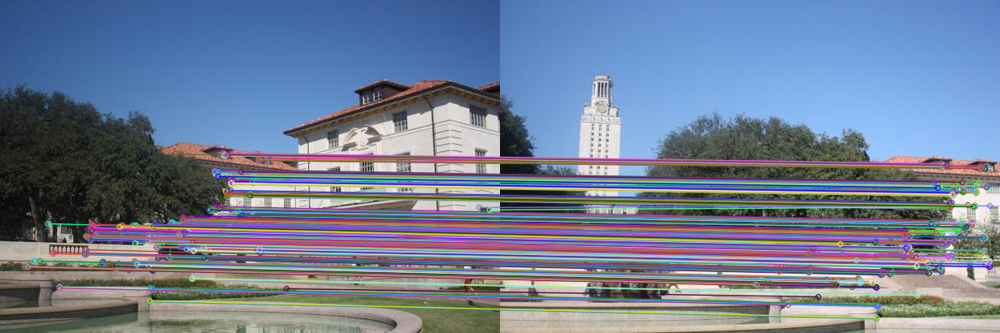
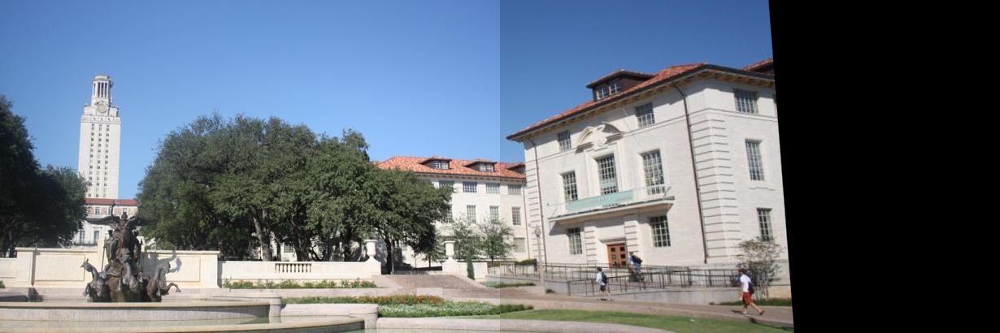
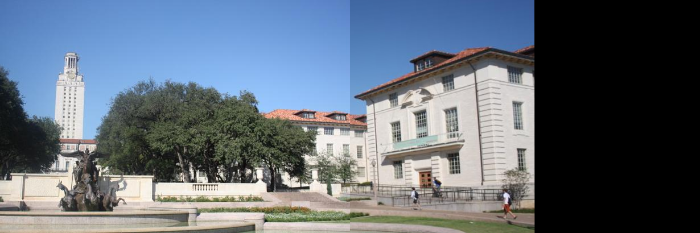

# 模式识别-全景图拼接

​                                                                段尧       20303053

# 实验目的

1. 熟悉 Harris 角点检测器的原理和基本使用
2. 熟悉 RANSAC 抽样一致方法的使用场景
3. 熟悉 HOG 描述子的基本原理
3. 熟悉 SIFT 描述子的基本原理

# 实验内容

1. 使用 Harris 角点检测器寻找关键点。
2. 构建描述算子来描述图中的每个关键点，比较两幅图像的两组描述子，并进行匹配。
3. 根据一组匹配关键点，使用 RANSAC 进行仿射变换矩阵的计算。
4. 将第二幅图变换过来并覆盖在第一幅图上，拼接形成一个全景图像。
5. 实现不同的描述子，并得到不同的拼接结果。

# 实验过程

## Harris 角点算法

任务说明：

> 请实现 Harris 角点检测算法，并简单阐述相关原理，对 images/目录下的 sudoku.png 图像
进行角点检测（适当进行后处理），输出对应的角点检测结果，保存到 results/目录下，命名
为 sudoku_keypoints.png。

### Harris 角点算法原理

Harris 角点检测算法如下：

1. 对于图像中的每个像素点

   1. 计算梯度（一般使用sobel算子）

   2. 计算结构矩阵（像素点邻域内梯度和的协方差矩阵）

   3. 计算角点响应函数（Harris响应函数）
      $$
      R=\det(M)-k\cdot(\mathrm{trace}(M))^2
      $$
      
      其中，$M$ 是结构矩阵，$dat(M)$ 表示矩阵 $M$ 的行列式,$trace(M)$ 表示矩阵的迹，$k$ 是常数。
      
   4. 对角点响应函数值进行阈值处理，选取大于阈值的像素点作为角点
   
   5. 对角点进行非极大值抑制，保留局部最大的角点。

在算法中存在一些超参数：

1. **窗口大小（Window Size）**：这是用于计算梯度的局部区域（窗口）的大小。通常是一个奇数，如 3x3 或 5x5。较大的窗口可以捕捉到更大范围的图像特征，但计算量也更大。
2. **Sobel 算子尺寸（Sobel Operator Size）**：这是用于计算图像梯度的 Sobel 算子的大小。它通常与窗口大小相匹配，但可以独立选择。
3. **高斯核尺寸（Gaussian Kernel Size）**：在计算梯度的协方差矩阵之前，通常使用高斯滤波器对梯度图像进行平滑。高斯核的尺寸决定了平滑的程度。
4. **高斯核标准差（Gaussian Kernel Sigma）**：与高斯核尺寸相关，决定了高斯滤波器的宽度，也就是在图像中影响每个点的尺度。
5. **Harris 角点检测的参数 k**：这个参数用于计算角点响应函数 R 的时候的一个因子，通常取值在 0.04 到 0.06 之间。它是一个经验值，用于平衡矩阵 M 的迹（trace）和行列式（determinant）。
6. **阈值（Threshold）**：用于确定一个点是否被认为是角点的阈值。超过这个阈值的点可以被认为是角点。
7. **非极大值抑制（Non-Maximum Suppression, NMS）窗口大小**：在非极大值抑制过程中，用于确定局部最大值的邻域窗口的大小。
8. **使用高斯加权或均值加权**：选择在计算梯度的协方差矩阵时，是否使用高斯加权或简单的均值加权。

### 代码实现与结果展示

代码实现如下：

```python
def harris_corner_detection(imagine, threshold=0.45, k=0.04, window_size=3):
    # Step 0: 高斯平滑
    image = cv2.GaussianBlur(imagine, (5, 5), 0)  # 使用 5x5 的高斯核进行平滑

    # Step 1: 使用 Sobel 算子计算梯度
    dx = cv2.Sobel(image, cv2.CV_64F, 1, 0, ksize=3)  # para 2 = -1 时表示自动选择深度
    dy = cv2.Sobel(image, cv2.CV_64F, 0, 1, ksize=3)

    # Step 2: 计算像素点邻域内梯度和的协方差矩阵（结构矩阵）
    Ixx = np.multiply(dx, dx)
    Ixy = np.multiply(dx, dy)
    Iyy = np.multiply(dy, dy)

    # Step 3: 计算像素点的角点响应函数，Harris 响应函数
    height, width = image.shape
    offset = window_size // 2  # offset 设置为窗口半径
    corner_response = np.zeros((height, width), dtype=np.float32)  # 初始化，用于存储每个像素点的角点响应函数值

    for y in range(offset, height - offset):
        for x in range(offset, width - offset):
            window_Ixx = Ixx[y - offset:y + offset + 1, x - offset:x + offset + 1]  # 切片列表得到子列表
            window_Ixy = Ixy[y - offset:y + offset + 1, x - offset:x + offset + 1]
            window_Iyy = Iyy[y - offset:y + offset + 1, x - offset:x + offset + 1]

            Sxx = np.sum(window_Ixx)
            Sxy = np.sum(window_Ixy)
            Syy = np.sum(window_Iyy)

            # Harris 响应
            det = (Sxx * Syy) - (Sxy ** 2)
            trace = Sxx + Syy
            corner_response[y, x] = det - k * (trace ** 2)

    # Step 4: 阈值处理
    # 将所有值放缩到0-255
    corner_response_normalized = cv2.normalize(corner_response, None,
                                               alpha=0, beta=255, norm_type=cv2.NORM_MINMAX, dtype=cv2.CV_8U)
    # 生成一个二值掩码，响应值超过阈值的设置为255
    _, corner_mask = cv2.threshold(corner_response_normalized,
                                   threshold * corner_response_normalized.max(), 255, 0)


    # Step 5: 非极大值抑制
    # corner_mask = cv2.dilate(corner_mask, None)  # 膨胀，增加角点响应区域
    # 尝试之后，感觉不应该使用膨胀操作
    # 膨胀操作的作用：增强角点响应，连接邻近角点，抵抗噪声，NMS的准备（膨胀后更容易找到局部最大值，膨胀会减少小的响应峰）
    corner_points = np.where(corner_mask == 255)  # 定位角点

    return list(zip(*corner_points[::-1]))
```

具体的算法步骤已经在前述内容与代码注释中说明，不再赘述。

结果展示如下：




## 关键点描述与匹配

任务说明：

> 1. 请使用实现的 Harris 角点检测算法提取 images/uttower1.jpg 和 images/uttower2.jpg 的关键点，并将提取的关键点检测结果保存到 results/目录下，命名为uttower1_keypoints.jpg和 uttower2_keypoints.jpg。
> 2. 分别使用 SIFT 特征和 HOG 特征作为描述子获得两幅图像的关键点的特征，使用欧几里得距离作为特征之间相似度的度量，并绘制两幅图像之间的关键点匹配的情况，将匹配结果保存到 results 目录下，命名为 uttower_match.png。使用 RANSAC 求解射变换矩阵，实现图像的拼接，并将最后拼接的结果保存到 results 目录下，命名为uttower_stitching_sift.png和 uttower_stitching_hog.png。并分析对比 SIFT 特征和 HOG 特征在关键点匹配过程中的差异。
> 3. 请将基于 SIFT + RANSAC 的拼接方法用到多张图像上，对 images/yosemite1.png,images/ yosemite2.png, images/ yosemite3.png,images/ yosemite4.png 进行拼接，并将结果保存到 results/目录下，命名为results/yosemite_stitching.png。

### SIFT 特征描述子

SIFT 特征描述子：通过检测图像中的局部特征点，并提取这些特征点周围的局部图像块的特征描述子。具有尺度和旋转不变的特性，SIFT描述子通常由128维的向量表示，这些向量编码了局部图像块的梯度方向直方图。

在代码实现中，调用 `opencv` 中的实现，其中关键点使用自己上一个任务中编写的 `harris_corner_detection` 角点检测算法，在这个任务中，将 `harris_corner_detection`函数的输出做了一定的更改：为了兼容后续的 `opencv`函数调用，将输出更改为 `从v。keyPoint` 类型，具体值没有变化。

```python
keypoints = [cv2.KeyPoint(x=float(coord[1]), y=float(coord[0]), size=3) for coord in corner_coords]
```

在 `siftimg_rightlignment` 函数中，调用`sift_kp` 函数提取 SIFT 描述子，进而使用 `get_good_match` 函数采用暴力匹配方式，获得最佳匹配特征点。然后调用 `cv2.findHomography` 获得投影变换矩阵，使用 `cv2.warpPerspective` 函数进行投影变换，之后进行图片拼接（注意我们的代码中，使用变换右侧图像，拼接到左侧的顺序）

```python
def sift_kp(image):
    # 提取 sift 描述子
    gray_image = cv2.cvtColor(image, cv2.COLOR_BGR2GRAY)
    # Using Harris corner detection to get keypoints
    harris_kp = harris_corner_detection(gray_image)
    # Compute SIFT descriptors
    sift = cv2.xfeatures2d.SIFT_create()
    _, des = sift.compute(gray_image, harris_kp)
    # kp_image = cv2.drawKeypoints(gray_image, harris_kp, None)
    kp_image = cv2.drawKeypoints(image, harris_kp, None)
    return kp_image, harris_kp, des

def get_good_match(des1, des2):
    bf = cv2.BFMatcher()
    matches = bf.knnMatch(des1, des2, k=2)  # des1为模板图，des2为匹配图
    matches = sorted(matches, key=lambda x: x[0].distance / x[1].distance)
    good = []
    for m, n in matches:
        if m.distance < 0.75 * n.distance:
            good.append(m)
    return good

def siftimg_rightlignment(img_right, img_left):
    _, kp1, des1 = sift_kp(img_right)
    _, kp2, des2 = sift_kp(img_left)
    goodMatch = get_good_match(des1, des2)
    # 当筛选项的匹配对大于4对时：计算视角变换矩阵
    if len(goodMatch) > 4:
        # 获取匹配对的点坐标
        ptsA = np.float32([kp1[m.queryIdx].pt for m in goodMatch]).reshape(-1, 1, 2)
        ptsB = np.float32([kp2[m.trainIdx].pt for m in goodMatch]).reshape(-1, 1, 2)
        ransacReprojThreshold = 4
        H, status = cv2.findHomography(ptsA, ptsB, cv2.RANSAC, ransacReprojThreshold)  #  用RANSAC选择最优的四组配对点，再计算H矩阵。H为3*3矩阵
        
        # 将图片右进行视角变换，result是变换后图片
        result = cv2.warpPerspective(img_right, H, (img_right.shape[1] + img_left.shape[1], img_right.shape[0]))
        # cvshow('result_medium', result)
        # 将图片左传入result图片最左端
        result[0:img_left.shape[0], 0:img_left.shape[1]] = img_left
        return result
```


### HOG 特征描述子

HOG 描述子的基本思想是：人体和物体的外观特征主要由局部区域的边缘、线条和纹理等构成，而这些特征的分布和方向对于目标的识别和检测至关重要。因此，HOG描述子将图像分成小的局部区域，并计算每个区域内像素的梯度信息，然后将这些梯度信息统计成梯度直方图，最后将这些直方图串联起来形成特征向量。

具体代码实现过程与 SIFT 基本一致，替换了拼接调用函数`hogimg_rightlignment`与特征点描述子提取函数`hog_kp`，其中 `hogimg_rightlignment`函数仅替换了 `sift_kp` 为 `hog_kp`，而 `hog_kp` 如下所示：

```python
def hog_kp(image):
    # Convert the image to grayscale
    gray_image = cv2.cvtColor(image, cv2.COLOR_BGR2GRAY)

    # Compute Harris corner detection to get keypoints
    harris_kp = harris_corner_detection(gray_image)

    # Initialize HOG Descriptor
    winSize = (8, 8)  # Define the size of the window for HOG descriptor
    blockSize = (8, 8)  # Define the size of the block for HOG descriptor
    blockStride = (4, 4)  # Define the stride of the block for HOG descriptor
    cellSize = (4, 4)  # Define the size of the cell for HOG descriptor
    nbins = 9  # Define the number of bins for HOG descriptor
    hog = cv2.HOGDescriptor(winSize, blockSize, blockStride, cellSize, nbins)

    # Compute HOG descriptors
    descriptors = []
    max_descriptor_length = 0
    for kp in harris_kp:
        x, y = kp.pt
        x, y = int(x), int(y)
        patch = gray_image[max(0, y - 8):min(y + 8, gray_image.shape[0]), max(0, x - 8):min(x + 8, gray_image.shape[1])]

        # Check if the patch size is sufficient for HOG computation
        if patch.shape[0] >= winSize[1] and patch.shape[1] >= winSize[0]:
            hog_desc = hog.compute(patch)
            descriptors.append(hog_desc.flatten())
            max_descriptor_length = max(max_descriptor_length, len(hog_desc))

    # Zero-pad or truncate descriptors to ensure uniform length
    padded_descriptors = []
    for desc in descriptors:
        if len(desc) < max_descriptor_length:
            padded_desc = np.pad(desc, (0, max_descriptor_length - len(desc)), mode='constant')
        else:
            padded_desc = desc[:max_descriptor_length]
        padded_descriptors.append(padded_desc)

    return harris_kp, np.array(padded_descriptors)
```


### RANSAC 抽样一致性方法

在这部分我们说明 RANSAC 抽样一致性方法求解仿射变换矩阵的原理：

RANSAC（Random Sample Consensus）算法是一种迭代方法，用于从具有异常值的数据集中估计数学模型参数。在计算机视觉中，RANSAC常用于求解仿射变换矩阵，即使在有噪声和异常值（如前景物体或遮挡）的情况下也能鲁棒地估计变换。

数学原理如下：

1. **随机抽样**：RANSAC算法从数据集中随机选择最小点集（对于仿射变换，通常是4个点），这些点称为“内点”（inliers）。

2. **模型拟合**：使用内点集来拟合一个数学模型。在仿射变换的情况下，这意味着求解一个 2×3或 3×3 的变换矩阵 $A$，该矩阵将源图像中的点映射到目标图像中的点。

3. **误差最小化**：对于仿射变换，通常使用最小二乘法来最小化所有点对的仿射误差。即最小化所有点对的误差平方和：

   $E=\sum_i\|y_i-Ax_i\|^2$

   其中，$x_i$ 是源图像中的点，$y_i$是目标图像中的对应点，$A$ 是仿射变换矩阵。

4. **异常值检测**：使用拟合好的模型来评估所有点与模型的误差。如果点的误差小于某个阈值$\tau$，则认为该点是内点；否则，它是异常值（outlier）。

5. **迭代过程**：重复上述步骤，每次随机选择新的内点集，直到达到预定的迭代次数或找到最佳模型。

6. **最佳模型选择**：在所有迭代中，选择拥有最多内点的模型作为最佳模型。

算法伪代码如下：

1. 从数据集$D$ 中随机选择一个最小点集 $S$。
2. 使用点集$S$ 来拟合仿射变换模型 $A$。
3. 对于数据集$D$中的每个点$x_i$，计算它通过变换$A$得到的点 $y_i$与实际目标点的误差。
4. 如果误差小于预设的阈值$\tau$，则认为$x_i$是内点；否则是异常值。
5. 重复步骤1-4，进行多次迭代。
6. 选择产生最多内点的变换矩阵$A$ 作为最佳估计。
7. 可选：使用所有内点对最佳变换矩阵$A$进行重新拟合，以提高精度。

### 图像拼接与结果展示

两图像拼接任务中，两图像的关键点检测结果：

|  |  |
| ------------------------------------------------------------ | ------------------------------------------------------------ |

两图像的关键点匹配结果：



两图像拼接结果（第一张为SIFT描述子，第二张为HOG描述子）：





多张图像拼接结果：


# 实验总结与问题解决

## 实验总结

本次实验主要围绕模式识别中的全景图拼接展开，涉及了Harris角点检测、RANSAC抽样一致性方法以及SIFT和HOG特征描述子的使用。

在Harris角点检测算法中，通过计算结构矩阵和角点响应函数，成功地检测到了图像中的角点，并使用非极大值抑制对角点进行了过滤和优化。

在关键点描述与匹配部分，通过SIFT和HOG特征描述子提取关键点的特征，并利用欧几里得距离作为相似度的度量方式进行匹配。通过RANSAC抽样一致性方法，成功地估计了仿射变换矩阵，并实现了图像的拼接。

总体而言，通过本次实验，加深了对模式识别中关键算法的理解，并掌握了相关的实现技巧和方法。同时，也对图像拼接任务有了更深入的认识和实践经验。

## 问题解决与注意点说明

1. 在 Harris 角点检测算法中，开始时应当考虑使用高斯模糊（平滑）进行预处理，否则可能出现很多奇怪的噪声点。有一些 人看起来不应该产生响应的空白点也会出现结果。需要说明，有的算法实现中，高斯平滑在计算出来的 梯度上，但是我实际尝试效果中，还是针对原图直接进行高斯平滑效果好一些。
2. 在 Harris 角点检测中，进行非极大化抑制之前，有的算法实现中继续宁膨胀操作，这个操作实际效果比较鸡肋。比如第一题图中的黑线框，每个黑线框十字交叉点处并没有把四个响应点合成一个响应点，反而效果中让点看起来很大很奇怪，另外我觉得不应该将十字交叉处的四个响应点合成为一个，比如两个这样的图片对齐时，必然是像素级别对齐，这时候四个响应点是都需要的。所以最终实现中，我没有使用这个膨胀操作。
3. 需要注意，`opencv` 的关键点有一个专门的类表示，要将普通关键点列表转换为 `opebcv` 中的表示形式，使用 `keypoints = [cv2.KeyPoint(x=float(coord[1]), y=float(coord[0]), size=3) for coord in corner_coords]`
3. 在多张图片拼接任务中，实际尝试效果，两两拼接后再拼接，与逐幅拼接相比，逐幅拼接效果更好。猜想是因为两两拼接中，实际上损失了不少边缘处的像素，所以造成最后拼接大图效果不佳。

# 参考文献 

[1] [OpenCV：SIFT（尺度不变特征变换）简介](https://docs.opencv.org/4.8.0/da/df5/tutorial_py_sift_intro.html)

[2] [OpenCV 特征检测](https://blog.csdn.net/qq_45832961/article/details/122764632)

[3] [Random sample consensus - Wikipedia](https://en.wikipedia.org/wiki/Random_sample_consensus)


